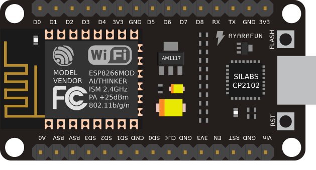

# Prysma-Controller

  
   
  <b>An arduino sketch to control addressable RGB led strips</b>

## IDE Installation/Setup Steps

1. (mac only) Setup serial recognition - https://apple.stackexchange.com/questions/334311/connection-of-esp32-esp8266-not-recognized-using-macbook-pro
2. Install the Arduino IDE (v1.8.9)
3. Install ESP8266 Board Manager: https://github.com/esp8266/Arduino#installing-with-boards-manager
4. Select the correct board: Tools -> Board -> NodeMCU 1.0
5. Set a fast upload speed: Upload Speed -> 460800

## SPIFFS File Uploader Setup

1. https://github.com/esp8266/arduino-esp8266fs-plugin#installation
2. Take templates/config.json and put it in the data folder after filling it out with the appropriate information

## Install Libraries

- WiFiManager by Tzapu: Version 0.14.0 (or latest)
- PubSubClient by Nick O'Leary: Version 2.7.0 (or latest)
  - Go to ~/Documents/Arduino/libraries/PubSubClient/src/PubSubClient.h and change MQTT_MAX_PACKET_SIZE to 512 instead of 128. This is because the messages sent by this app are greater than 128 bytes and will be ignored by the pubsubclient unless increased.
- ArduinoJson by Benoit Blanchon: Version 6.11.1
  <!-- - FastLED by Daniel Garcia: Version 3.2.6 (or latest) -->

## Features

- The builtin LED will be on until the wifi is connected
- It will automatically discover and connect to any MQTT brokers being advertized over MDNS with priority going to prysma.local hostnames
- Arduino OTA sketch and data uploads
  - All config info such as number of leds and mqtt password are loaded from a config file stored in SPIFFS
